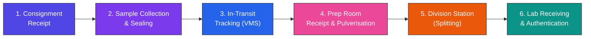
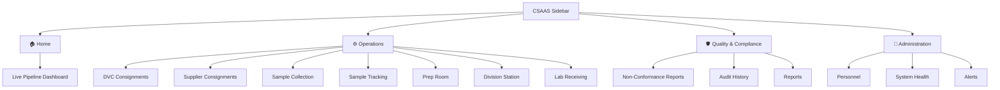
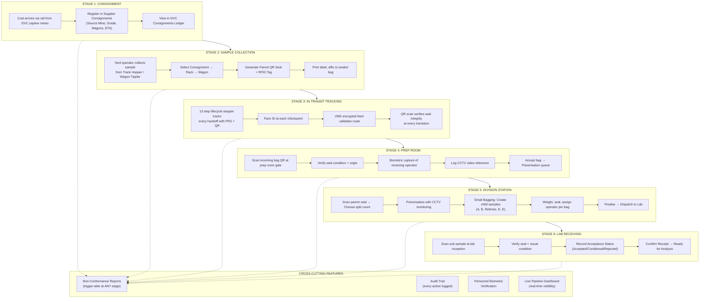

# CSAAS — Coal Sample Anti-Adulteration System
## Presentation Brief: End-to-End Feature Walkthrough

---

## 🏗️ What is CSAAS?

**CSAAS** (Coal Sample Anti-Adulteration System) is a **React + TypeScript UI prototype** for managing the **complete chain of custody** of coal samples — from the moment coal arrives at a DVC (Damodar Valley Corporation) thermal power plant via rail, through sample preparation and division, all the way to laboratory analysis.

Its goal is to **prevent coal adulteration** by creating a tamper-proof, digitally tracked, biometrically verified chain of custody at every stage.

---

## 📐 Technology Stack

| Layer | Technology |
|---|---|
| **Framework** | React 19 + TypeScript |
| **Build Tool** | Vite 6 |
| **Styling** | TailwindCSS 4 |
| **Animations** | Motion (Framer Motion) |
| **Icons** | Lucide React |
| **Data** | Mock data (no backend — UI prototype) |

---

## 🗺️ Complete Process Flow

---

## 🧭 Navigation Architecture

The app uses a **sidebar-based SPA navigation** with three logical groups:

A **Process Breadcrumb** bar appears on all operational screens linking the 5-step flow:
`Consignment → Collection → Prep Room → Division → Lab`

---

## 📊 Section-by-Section Feature Breakdown

---

### 1️⃣ Live Pipeline Dashboard

> **Purpose**: Real-time shift-level command center for the entire coal sample pipeline.

**Features:**
- **6 KPI Cards**: Total Wagons, Active Samples, Completed, Compliance Rate, Avg GCV, Open NCRs — with trend indicators
- **Hourly Throughput Chart**: SVG bar chart showing samples processed per hour in the current shift
- **Sample Distribution Donut**: Visual breakdown by pipeline stage (Completed, In Preparation, Consignment, Lab Queue, Division)
- **Coal Grade Distribution**: Horizontal bar charts showing wagons by BIS grade (G9–G13 with kCal/kg range)
- **Pipeline Flow**: Clickable vertical list showing live sample counts at each stage — clicking navigates to that stage
- **Shift Performance Gauge**: Ring gauge showing daily quota progress (e.g. 42/200 = 21%)
- **Live Activity Feed**: Real-time event stream with color-coded dots
- **Active NCR Table**: Non-Conformance reports with stage, category, and status

---

### 2️⃣ DVC Consignments

> **Purpose**: View inbound coal racks from DVC captive mines, allocated blocks, and CIL subsidiaries.

**Features:**
- **4 KPI Cards**: Active Racks, Pending Discharge, Verified Wagons, Avg GCV
- **Inbound Manifest Ledger Table**: Shows Rack ID, Source Mine, DVC Plant, ETA/Arrival, Wagon count, Status (UNLOADING, IN_TRANSIT, QUEUED, READY)
- **Navigation** to Supplier Consignments for registration

**Data Tracked:**
- Rack ID (e.g., `RCK-9901-A`)
- Source mine with location (e.g., "Bermo Mine / Kargali, Bokaro")
- Destination DVC plant (e.g., "Bodor TPS-A")

---

### 3️⃣ Supplier Consignment Registration

> **Purpose**: Register new inbound coal consignments with source, quality, and logistics details.

**Features:**
- **Registration Modal** with 3 sections:
  - **Source Details**: Source Mine dropdown (9 DVC mines), Source Mine Options (ROM/Washed/Crushed/Mixed Grade), DVC Receiving Plant
  - **Quality Specifications**: Declared Grade (G6–G17), Declared GCV (kCal/kg)
  - **Logistics Manifest**: Rack ID, Total Wagon Count, ETA
- **Consignment Ledger Table**: Shows Consignment ID, Source Mine, Contract No., DVC Plant, Rack/Wagons, Grade/GCV, Sampling Agency, Status

---

### 4️⃣ Sample Collection & Seal Generation

> **Purpose**: Register yard sample collection and generate the parent QR seal + RFID tag.

**Features:**
- **Collection Form** capturing:
  - Consignment selector (auto-fills rack ID)
  - Sample Source Type: **Track Hopper** or **Wagon Tippler** (toggle buttons)
  - Equipment ID, Rack ID, Wagon Number
  - Collector/Operator selector
  - Auto-captured Date/Time
  - Seal Number + RFID Tag Number
- **QR Label Preview Panel**: Generates a visual parent sample seal label showing:
  - CSAAS branding + DVC header
  - QR code visual with corner brackets
  - Parent Sample ID, Seal No., RFID tag
  - Consignment, Source, Rack/Wagon, Collector, Time
  - **Print Label** + **Confirm & Register** buttons
- **Recent Collections Table**: Lists all QR seals generated in the current shift

**Key Anti-Adulteration Feature:**
- Every parent sample gets a unique QR seal + RFID tag binding it to its source consignment, wagon, and collector.

---

### 5️⃣ End-to-End Sample Tracking (Chain of Custody)

> **Purpose**: Immutable lifecycle monitoring from extraction to laboratory — the core anti-adulteration feature.

**Features:**
- **12-Step Process Protocol Stepper**:
  1. Sample Collection (Track Hopper / Wagon Tippler)
  2. Identity Capture (ID Scan & Face Analytics)
  3. Sealing Sequence (Tamper-Evident QR Lock)
  4. Parent ID Issuance (Registry Entry)
  5. VMS Path Tracking (Approved Logistics Route)
  6. Prep Room Receipt (Face ID + Scan In)
  7. Integrity Verification (Visual Seal Audit)
  8. Pulverisation (CCTV Monitored Grinding)
  9. Division Logic (Sub-Sample Generation)
  10. ID Linkage (Relational DB Sync)
  11. Lab Dispatch (QR Scan + Manifest Check)
  12. Lab Authentication (Incoming Verification)

- **Step Detail Popup**: Clicking any completed step shows:
  - **CCTV FRS Capture** — Face image from camera with corner-bracket overlay, match percentage, camera ID
  - Operator name, role, badge ID
  - Location, Verification Method
  - Notes (if any)

- **Biometric Verification Panel**: Shows simulated CCTV face recognition with match percentage
- **Chain of Custody Data Card**: Parent Sample ID, QR Seal, Current Phase, "Generate Forensic Receipt" button
- **Scan Next Phase**: Simulates QR seal verification with progress bar → Verified (advance to next step) or Compromised (seal breach detected → Raise NCR)
- **VMS Security**: Shows encrypted feed status indicator

---

### 6️⃣ Preparation Room (Prep Room)

> **Purpose**: Scan incoming raw coal bags, verify seal integrity, and accept bags for pulverisation.

**Features:**
- **QR Bag Scanner**: Manual entry or click-to-simulate scan
- **Scan Result Overlay**:
  - Scanning animation with progress bar
  - **Verified**: Shows bag details (ID, Source, Consignment, Weight, QR Seal) → Capture Operator Biometric → Accept
  - **Failed**: "Bag Not Recognised" with Raise NCR option
- **Prep Room Record** (required before acceptance):
  - Receiving Person selector
  - Seal Condition: Intact / Damaged / Missing
  - CCTV Video Reference clip ID
- **Pending Bag Queue Table**: Shows bags awaiting receipt with scan & accept actions
- **Prep Room Protocol**: 5-step visual protocol guide
- **All Bags Received**: "Pulverisation queue ready" banner with "Proceed to Division" button

---

### 7️⃣ Sample Division Station (Splitting)

> **Purpose**: Pulverisation and splitting of parent samples into child sub-samples (A, B, Referee, D, E).

**Features:**
- **Session List View**:
  - KPI: Active Sessions, Completed Today, Awaiting Seal
  - Sessions Table with Session ID, Parent Sample, Colliery, Weight, Operator, Split count, Status
  - **Start New Session** modal to select from available parent samples

- **Session Detail View** (3-phase workflow):
  - **Phase 01 — Parent Seal Integrity**:
    - AWAITING_SPLIT: "Scan Seal Now" button with QR verification overlay
    - Seal verified → Set number of child splits (1–5), then begin bagging
    - IN_PROGRESS: Live CCTV feed with face ID match overlay, OCR result, seal verification status

  - **Phase 02 — Pulverisation Log**:
    - Mark parent QR as opened
    - Records: Opening Time, Operator, N dynamic Pulveriser Unit rows with CCTV Clip IDs
    - Operator and CCTV ID selection form

  - **Phase 03 — Small Bagging (Child QR Seal Generation)**:
    - Dynamic bag types based on split count: Sample A, Sample B, Referee, Sample D, Sample E
    - Per-bag: Weight input, Operator assignment, auto-generated Seal ID
    - **Seal All Bags** button → Finalise Session
    - Visual summary cards for each child bag

---

### 8️⃣ Lab Receiving & Authentication

> **Purpose**: Final stage — verify and log incoming sub-samples from the Division Station.

**Features:**
- **3 KPI Cards**: Samples in Transit, Received Today, Flagged Exceptions
- **Batch Verification Panel**:
  - Scan/enter sample ID
  - **Receipt Record** form:
    - Lab Receiver selector
    - Auto-captured Receipt Time
    - Acceptance Status: Accepted / Conditional / Rejected
    - Visual Condition: Intact / Seal-Damaged / Label-Damaged
  - **Confirm Receipt** button (gated on all fields filled)
  - Success banner on confirmation
- **Pending Receipts Table**: Sub-Sample ID, Parent ID, Weight, Status (In Transit / Flagged / Received)
- **Quick Actions**: Weight Mismatch, Damaged Seal shortcuts

---

## 🛡️ Quality & Compliance Modules

### Non-Conformance Reports (NCR)
- **Full NCR Form**: Consignment ID, Reporting Authority, NCR Category (Seal Integrity / Mass Variance / Foreign Material / Administrative Error), Manifested vs. Measured Mass, Incident Documentation, Visual Evidence upload
- **Inline NCR Modal**: Can be triggered from any operational screen via the header "Flag Issue" button — auto-detects the current stage (Consignment/Collection/Transit/Prep/Division/Lab)

### Audit History
- Historical audit trail of all system events

### Report Builder
- Generate compliance and operational reports

---

## 👤 Administration Modules

### Personnel Management (Authority & Logistics)
- **Personnel Registry Table**: Identity, Assigned Protocol (role), Active Logic (status), Sample Activity counts (P/C/L/N chips), Face Metrics enrollment status
- **VMS Biometrics Panel**: Connect live CCTV frame for biometric capture
- **Security Permission Matrix**: Role-based access control (Weighbridge Registry, Sample Extraction Logic, Industrial Ledger Write, System Telemetry Edit)
- **Sample Activity Panel** (on operator click): 4-tab view:
  - **Parent Samples**: QR generation activity
  - **Child Samples**: Sub-sample handling
  - **Lab Receipts**: Acceptance/Conditional/Rejected logs
  - **NCR Filings**: Non-conformance reports filed

### System Health
- System performance and connectivity monitoring

### Alert Configuration
- Configure alert rules and notification preferences

---

## 🔗 How Sections Connect: The Complete Journey

---

## 🔑 Key Anti-Adulteration Controls

| Control | Where Applied | How |
|---|---|---|
| **QR Seal Tagging** | Collection, Prep Room, Division | Every sample gets a unique tamper-evident QR + RFID |
| **Face Recognition (FRS)** | Tracking, Prep Room, Division | CCTV-captured face matched against biometric database |
| **CCTV Monitoring** | All stages | Video clips linked to sample IDs for audit trail |
| **Seal Integrity Checks** | Tracking, Prep Room, Division | QR scan → Verified/Compromised with auto NCR |
| **Parent-Child ID Linkage** | Division Station | Parent sample mathematically linked to all child bags |
| **Weight Validation** | Collection, Prep, Division, Lab | Mass recorded and compared at every handoff |
| **Role-Based Access** | Personnel Module | Only authorized operators can perform specific actions |
| **Non-Conformance Reports** | All stages | Instant NCR flagging from any screen |
| **Immutable Audit Trail** | System-wide | Every step logged with operator, timestamp, location |

---

## 📌 Presentation Talking Points

1. **Problem**: Coal adulteration during transit from mine to lab costs millions — quality degradation, financial losses, trust deficit
2. **Solution**: CSAAS creates a **digitally sealed, biometrically verified, CCTV-monitored** chain of custody
3. **6-Stage Pipeline**: Every stage is connected — a sample can be traced from its origin mine down to the specific lab analyst who received it
4. **Real-Time Visibility**: The Dashboard gives shift supervisors instant insight into pipeline bottlenecks
5. **Zero-Gap Security**: QR seals + RFID tags + Face Recognition + CCTV clips at every handoff point
6. **Exception Handling**: Non-Conformance Reports can be raised from any screen, auto-tagged to the relevant stage
7. **Personnel Accountability**: Every operator's sample custodianship history is tracked and auditable
8. **Scalable Design**: DVC-specific data (mines, plants, contracts) demonstrates real-world applicability
